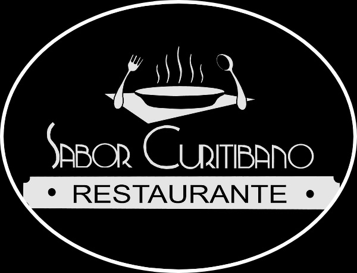

<h1>Restaurant-Website Sabor Curitibano!</h1>
 Projeto desenvolvido para estudo!

<!-- PROJECT LOGO -->
 
    

  <h3 align="center">Learning HTML - CSS - JS</h3>
  <h4>100% Responsive Website Dark and Light theme</h4>

<!-- TABLE OF CONTENTS -->

  
Table of Contents

  <ol>
    <li>
      <a href="#about-the-project">About The Project</a>
      <ul>
        <li><a href="#built-with">Built With</a></li>
      </ul>
    </li>
    <li><a href="#license">License</a></li>
    <li><a href="#contact">Contact</a></li>
    <li><a href="#acknowledgments">Acknowledgments</a></li>
  </ol>

<!-- ABOUT THE PROJECT -->
## Images

    
    
    
    

## About The Project
Project initially created to study and improve my understanding, further improving my knowledge obtained in the courses. 
(Projeto criado inicialmente para estudar e aprimorar minha compreensão, aprimorando ainda mais meus conhecimentos obtidos nos cursos.)

Taking advantage of my brother's restaurant and used as the subject of the study. 
(Aproveitando o restaurante de meu irmão e usado como tema do estudo.)

(<a href="#top">back to top</a>)

### Built With

* [HTML](https://pt.wikipedia.org/wiki/HTML)
* [CSS](https://pt.wikipedia.org/wiki/Cascading_Style_Sheets)
* [JavaScript](https://pt.wikipedia.org/wiki/Brendan_Eich)

(<a href="#top">back to top</a>)

<!-- LICENSE -->
## License

Distributed under the MIT License. See `LICENSE.txt` for more information.

(<a href="#top">back to top</a>)

<!-- CONTACT -->
## Contact

Maycon Batista - [Linkedin](https://www.linkedin.com/in/maycon-batista-71a176238/) - [E-mail](tiutrix@hotmail.com)

Project Link: [https://github.com/MayconTrix/Restaurant-Website](https://github.com/MayconTrix/Restaurant-Website)

(<a href="#top">back to top</a>)

<!-- ACKNOWLEDGMENTS -->
## Acknowledgments

* [Emerson Braun](https://github.com/EmersonBraun)
* [Luis Costa](https://github.com/luiscostalafc)
* [RocketSeat](https://www.rocketseat.com.br/)
* [Cod3r](https://www.cod3r.com.br/)
* [Rafaella Ballerini](https://www.youtube.com/c/rafaellaballerini)
* [Bedimcode ](https://www.youtube.com/c/Bedimcode)

(<a href="#top">back to top</a>)

